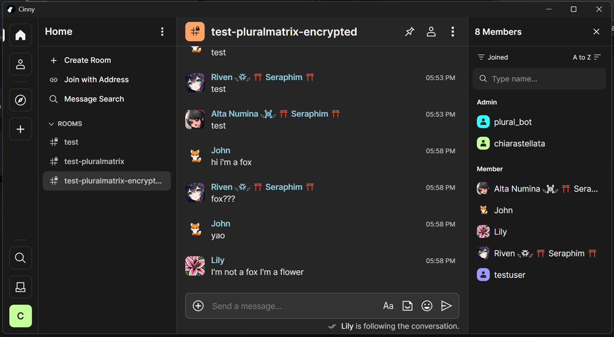
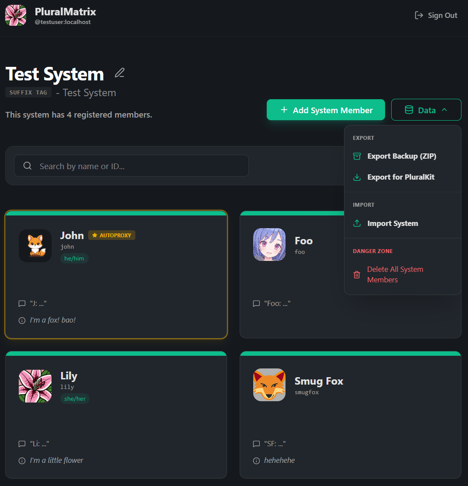
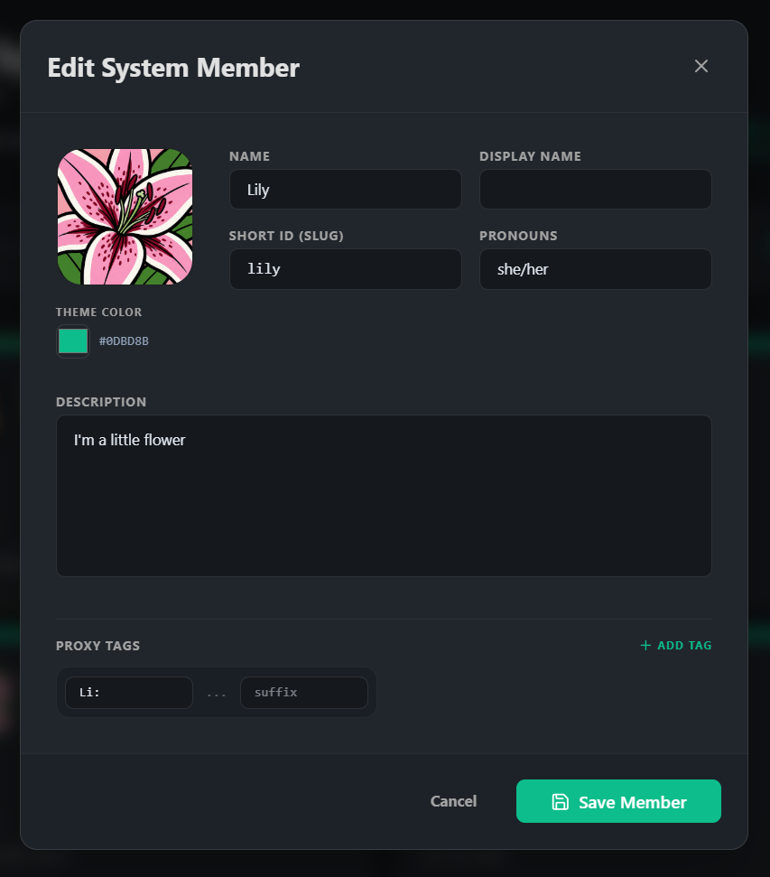

#  PluralMatrix

PluralMatrix is a Matrix Application Service designed for plural systems using Matrix, the open-source alternative to Discord. As in PluralKit, message prefixes are used to speak as each system member. But in PluralMatrix, every system member is represented by a unique "ghost" user who automatically joins rooms and sends messages on that member's behalf, providing a more native Matrix experience.

**Deployment & Compatibility:** PluralMatrix is an Application Service requiring administrative access and installation on your homeserver; it cannot be invited to third-party servers like matrix.org. The "Zero-Flash" feature requires a custom Synapse module, but all other functionality—including E2EE and the web dashboard—is compatible with any standard Matrix server.

## Visuals <a name="visuals" href="#visuals">#</a>

<div align="center">
  
  <br><br>
  
  <br><br>
  
</div>

## Core Features <a name="core-features" href="#core-features">#</a>

### High-Fidelity Proxying ("Zero-Flash")
- **Instant Cleanup:** A custom Synapse module intercepts and drops original proxy trigger messages before they are stored, ensuring a clean timeline without original messages ever appearing.
- **Rich Presence:** Proxied messages use custom display names, avatars, and system tags.
- **Relation Preservation:** Full support for replies and other Matrix event relations.

### Native E2EE Support
- **Full Encryption:** The bot and all system ghosts natively send and receive encrypted messages via the Matrix Rust SDK, ensuring high-fidelity proxying in secure rooms.
- **Secure by Design:** Automated registration and secure cryptographic state management for all system identities.

### Modern Dashboard
- **Web-based Management:** A React-based UI for managing system members, settings, and avatars.
- **Matrix Authentication:** Sign in directly using your Matrix credentials.
- **Live Sync:** Real-time updates to ghost profiles and proxy rules.

### Data Portability (PluralKit Compatible)
- **Easy Migration:** Import your system directly from a PluralKit JSON export.
- **Full Exports:** Export your system data and avatar assets (ZIP) for backup or migration.
- **Roundtrip Fidelity:** Maintains IDs and slugs for consistent cross-platform use.

### Advanced Bot Commands
These commands are designed to work exactly like their PluralKit equivalents for familiarity and ease of use.

- `pk;list`: View all system members.
- `pk;member <slug>`: View detailed information about a member.
- `pk;e <text>`: Edit your last proxied message or a specific replied-to message.
- `pk;rp <slug>`: Change the identity of a previously proxied message (Reproxy).
- `pk;message -delete`: Remove a proxied message.
- **Emoji Reactions:** React with ❌ to any proxied message to delete it instantly.

### Smart System Management
- **Automatic Slugs:** Generates clean, unique IDs for members from names or descriptions.
- **Ghost Decommissioning:** Automatically cleans up ghost users and their room memberships when a member is deleted.
- **Profile Syncing:** Ensures global Matrix profiles stay in sync with your system dashboard.

## Privacy & Security Considerations <a name="privacy-security" href="#privacy-security">#</a>

PluralMatrix requires access to message content to function. Users and server administrators should be aware of the following:

- **Server Admin Access:** The administrator of the server running the PluralMatrix application service has access to all messages sent to and from `@plural_bot` and the ghost users. This is unavoidable because the application service must store the cryptographic keys required to decrypt your proxy commands and encrypt the resulting ghost messages.
- **Message Decryption in Memory:** In order to check if a message contains a proxy tag, the bridge must decrypt the message. This means messages sent in rooms where the bot is present will temporarily exist in cleartext within the server's memory.
- **Database Storage:** While message history is not retained by the bridge, any system member data you create or import (names, avatars, proxy tags, etc.) is stored in the PluralMatrix PostgreSQL database.
- **Homeserver Visibility:** Because the bot and ghost users participate in your rooms, the homeserver hosting PluralMatrix will receive and store a copy of the room's encrypted event history, just like any other user's homeserver in a federated room.

## Installation & Setup <a name="installation-setup" href="#installation-setup">#</a>

### Prerequisites
- Docker & Docker Compose
- A Matrix Homeserver (Synapse required for Zero-Flash support)

### Quick Start
1. Clone the repository from [GitHub](https://github.com/pluralmatrix/pluralmatrix):
   ```bash
   git clone https://github.com/pluralmatrix/pluralmatrix.git
   cd pluralmatrix
   ```
2. Run the setup script:
   ```bash
   ./setup.sh
   ```
3. Run the restart script to initialize the services:
   ```bash
   ./restart-stack.sh
   ```
4. Invite `@plural_bot:yourdomain.com` to the rooms you wish to use it in.
5. Access the dashboard at `http://localhost:9000`.

**Note:** By default, PluralMatrix launches its own Synapse demo server for local testing, but it can be easily configured to integrate with any existing Matrix homeserver.

## Client Configuration <a name="client-configuration" href="#client-configuration">#</a>

For the best experience and a clean timeline, we recommend these client-specific settings (last tested February 2026).

**Note:** With the **Synapse Zero-Flash patch**, onlookers can use **any client** without seeing placeholders; only the sender needs these settings to hide their own redacted original messages.

### Mobile
- ⚙️ **Element Classic:** Disable **Settings → Preferences → Show removed messages**.
- ❌ **Element X:** Not recommended (no option to hide redacted messages).
- ⚙️ **FluffyChat:** Enable **Settings → Chat → Hide redacted messages**.
- ✅ **SchildiChat Legacy:** Disable **Settings → Preferences → Timeline → Show removed messages** (off by default).
- ❌ **SchildiChat Next:** Not recommended (no option to hide redacted messages).

### Desktop / Web
- ✅ **Cinny:** Ensure **Settings → General → Show Hidden Events** is disabled (off by default).
- ⚙️ **Element:** Disable **Settings → Preferences → Timeline → Show a placeholder for removed messages**.
- ⚙️ **FluffyChat:** Enable **Settings → Chat → Hide redacted messages**.
- ✅ **Fractal:** Hides deleted messages by default—no configuration needed!
- ⚙️ **NeoChat:** Disable **Settings → General → Show deleted messages**.
- ❌ **nheko:** Not recommended (no option to hide redacted messages).
- ✅ **SchildiChat Desktop (deprecated):** Disable **Settings → Preferences → Timeline → Show a placeholder for removed messages** (off by default).
- ✅ **SchildiChat Revenge:** Disable **Settings → Conversation screen → Show deleted messages** (off by default).

## Testing <a name="testing" href="#testing">#</a>
PluralMatrix includes a comprehensive test suite covering the App Service (unit and E2E) and the Synapse module.

### App Service (Backend & E2E)
Run the full suite of unit and end-to-end tests using the provided runner script:
```bash
cd app-service
./test.sh
```
*This script handles Matrix Rust SDK cleanup gracefully and ensures the process exits correctly.*

### Synapse Module (Python)
Run the unit tests for the custom Synapse gatekeeper module directly inside the container:
```bash
./synapse/modules/test.sh
```

